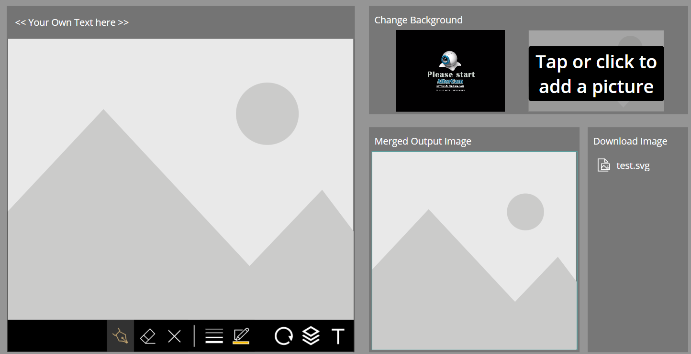
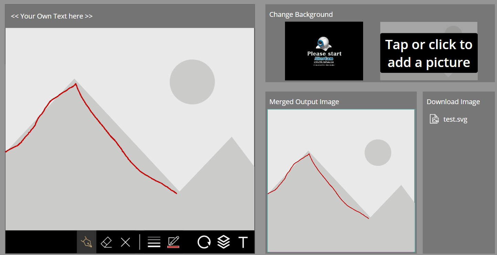
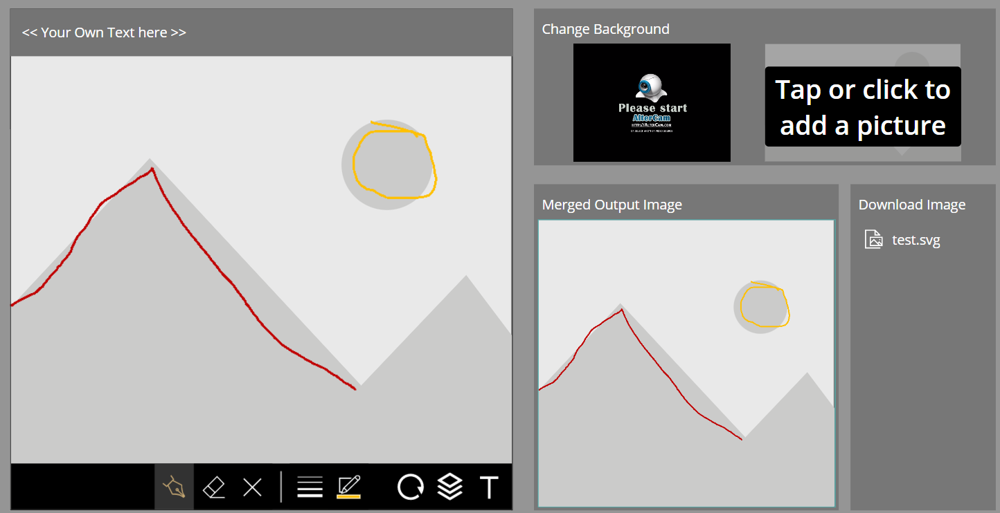
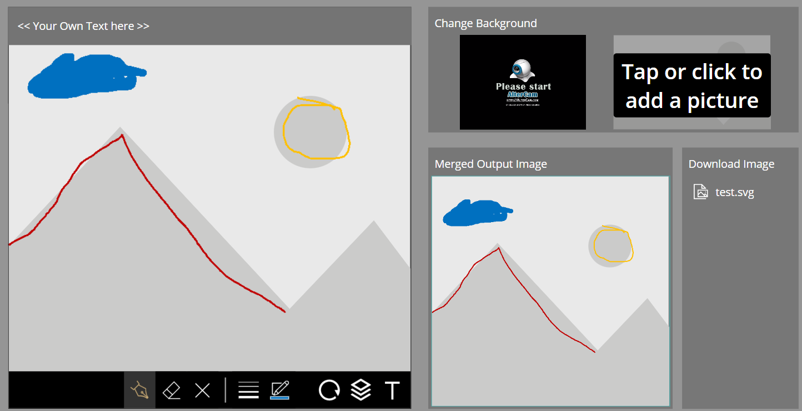
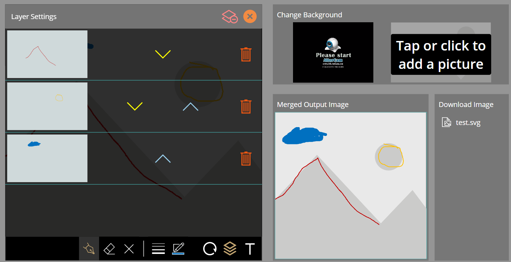
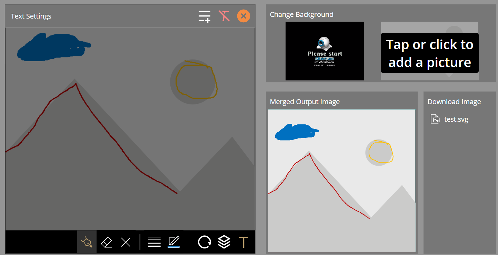
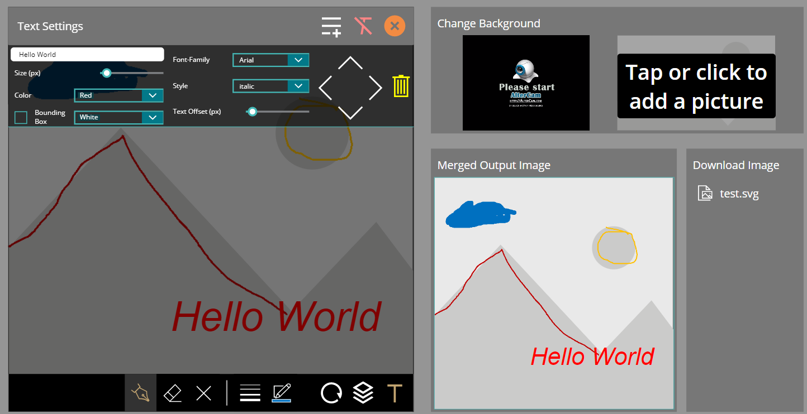
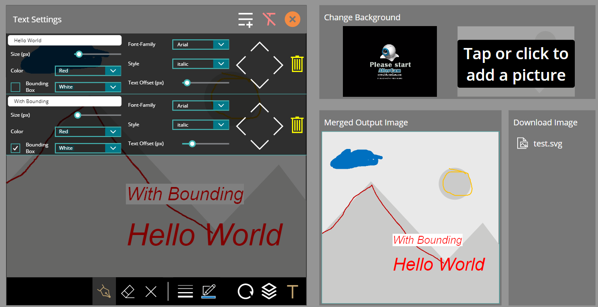

# PowerApps-SVG-Merge-Modul

`EN`
Merge multiple images seamlessly in PowerApps without the need for any complex coding or external flow components. With the easy-to-use Over Layer Settings, you can easily adjust the order of any layers, while the Over Text Settings lets you add and position text over the arrows with or without a bounding box. The result is a high-quality *.SVG image that you can download.

`DE`
Fügen Sie Bilder in PowerApps nahtlos zusammen, ohne auf komplexe Codierung oder externe Flow-Komponenten angewiesen zu sein. Mit den einfachen Over-Layer-Einstellungen können Sie die Reihenfolge der Ebenen anpassen, während Sie mit den Over-Text-Einstellungen Texte mit und ohne Begrenzungsrahmen hinzufügen und die Position der Texte über die Pfeile ändern können. Das Ergebnis wird in einer hochwertigen *.SVG-Datei generiert, die Sie herunterladen können.

## Screenshots

## Video

https://github.com/mlnc21/PowerApps-SVG-Merge-Modul/assets/80674540/d096e6ee-9208-49b5-b75b-3bbae3e73f1c

## Features V1.1.0

- Text Control
- Layer Control

## Minimal Path to Awesome

* [Download](SVGMergeModulExample.zip) the `.zip`
* Within **make.powerapps.com**, use the `.zip` file using **App** > **Import Canvas App**  and select the `.zip` file you just downloaded.
* Select the **Upload** Button

* Give your Uploaded `.zip` a **AppName** and **Import** the App.

## Disclaimer

**THIS CODE IS PROVIDED *AS IS* WITHOUT WARRANTY OF ANY KIND, EITHER EXPRESS OR IMPLIED, INCLUDING ANY IMPLIED WARRANTIES OF FITNESS FOR A PARTICULAR PURPOSE, MERCHANTABILITY, OR NON-INFRINGEMENT.**
